#  Dental Conversational Booking Assistant

A domain‑restricted, LLM‑powered conversational system for **dental appointment intake and booking**, built with FastAPI + Streamlit. The assistant conducts structured symptom intake, maps cases to dental specialties, enforces medical guardrails (no treatment advice), collects insurance details, and books 15‑minute doctor slots through a scheduling engine.

This project is designed as a reviewer‑grade assignment demonstrating conversational control, guardrails, multi‑turn memory, domain reasoning, and end‑to‑end booking workflow.

---

#  Key Capabilities

* Multi‑turn conversational intake (context aware)
* Dental‑only domain guardrail
* Zero treatment advice policy (appointment only guidance)
* Symptom → Specialty inference engine
* Specialty → Doctor mapping
* Doctor → Slot scheduling (15‑minute blocks)
* Insurance capture workflow (conditional)
* Authenticated booking with slot locking
* Streamlit chat UI with live booking buttons
* Synthetic multi‑clinic, multi‑doctor demo dataset

---
# 📸 Screenshots

## Symptom Intake Conversation


## Specialty Detection + Doctor Suggestions


## Insurance Collection Step


## Available Slots Display


## Booking Confirmation


#  Conversational Guardrails

The assistant is strictly constrained to:

* Answer **only dental topics**
* Never give treatment or medication advice
* Always redirect toward professional appointment
* Ask limited, natural intake questions (no interrogation loops)
* Show doctors only after user confirmation
* Show slots only after doctor selection + insurance gate

---

#  System Architecture


---

#  Conversation State Machine

```mermaid
flowchart TD
    A[User Symptoms] --> B[Intake Questions ≤ 3]
    B --> C[Specialty Inferred]
    C --> D[Treatment Asked?]
    D -->|Yes| E[Refuse Treatment + Offer Doctors]
    D -->|No| F[Ask Permission to Show Doctors]

    E --> G[User Confirms]
    F --> G

    G --> H[Show Doctor List]
    H --> I[Doctor Selected]
    I --> J[Insurance Gate]

    J -->|No Insurance| K[Show Slots]
    J -->|Has Insurance| L[Collect Provider + Member ID]
    L --> K

    K --> M[User Selects Slot]
    M --> N[Booking Confirmed]
```



---

#  Project Structure

```text
backend/
  api/
    chat_api.py
    auth_api.py
    booking_api.py
  services/
    conversation_controller.py
    domain_filter.py
    symptom_mapper.py
    doctor_lookup.py
    scheduler.py
  llm/
    grok_client.py
  models/
    db.py
    entities.py

frontend/
  app.py

seed_full_demo_data.py
requirements.txt
README.md
```

---

#  Setup Instructions

## 1️⃣ Create Virtual Environment

```bash
python -m venv venv
venv\Scripts\activate
```

## 2️⃣ Install Dependencies

```bash
pip install -r requirements.txt
```

## 3️⃣ Create Database Tables

```bash
python -c "from backend.models.db import Base, engine; import backend.models.entities; Base.metadata.create_all(engine)"
```

## 4️⃣ Seed Demo Data

Creates services, clinics, doctors, mappings, and multi‑day slots.

```bash
python seed_full_demo_data.py
```

## 5️⃣ Run Backend

```bash
uvicorn backend.main:app --reload --port 8000
```

Swagger docs:

```
http://127.0.0.1:8000/docs
```

## 6️⃣ Run Frontend

```bash
streamlit run frontend/app.py
```

---

#  Authentication Flow

* User registers / logs in
* JWT token returned
* Token used for booking endpoint
* Booking stored with user_id + slot_id

---

#  Insurance Flow

If user has insurance:

* Provider name collected
* Member / policy ID collected
* Stored in `insurance_info` table
* Booking proceeds after capture

If no insurance:

* Slots shown directly

---

#  Slot Engine

* Working hours: 9 AM – 5 PM
* Slot size: 15 minutes
* Per‑doctor schedule
* Slot locked on booking
* Booked slots removed from availability


---

#  Reviewer Demo Scenarios

Recommended test cases:

1. Crown came off → Restorative Dentistry → booking
2. Bleeding gums → Periodontal → booking
3. Severe nerve pain → Root Canal → booking
4. Braces wire issue → Orthodontics → booking
5. Non‑dental query → rejected by guardrail
6. Treatment request → refused → redirected to doctor

---

#  Safety & Guardrail Strategy

* Keyword + history dental domain filter
* Treatment advice detector on LLM output
* Controller stage gating
* No slot exposure before doctor selection
* No booking without auth

---

#  Assignment Objectives Covered

* Conversational AI system
* Context memory
* Domain restriction
* Guardrails
* Structured intake
* Decision routing
* Scheduling engine
* Real booking persistence
* Multi‑clinic support
* Insurance workflow

---

#  Status

Production‑ready demo build suitable for technical review and live walkthrough.

---

If needed, architecture extensions can include: reminders, EHR integration, real calendar sync, and triage scoring.
